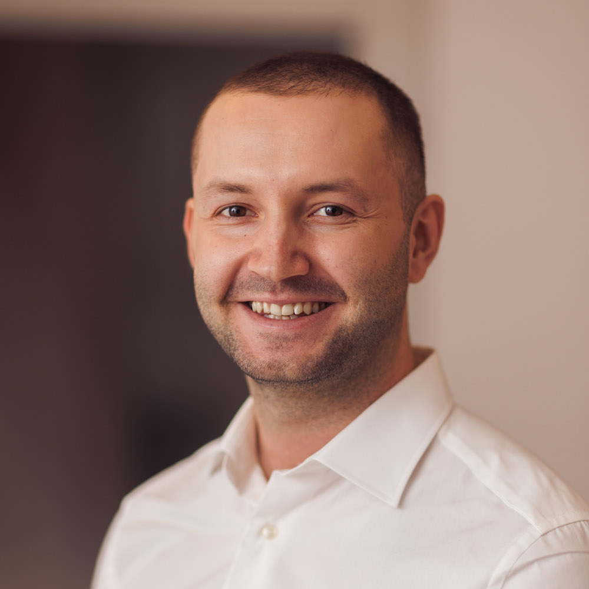

# Max Perea Düring 
Software Developer, Happi Hacking AB

<a href="max@happihacking.se">max@happihacking.se</a>
| <a href="http://en.wikipedia.org/wiki/Isaac_Newton">+46 707 96 90 10</a>

## Profile

Max is a software developer with a broad range of interests and
skills. He recently graduated with a MSc degree in Computer and
Information Engineering from Uppsala University.

Although he is especially interested in the functional programming
paradigm and has experience with a range of functional languages such
as Erlang, Haskell, and Lisp, he is also well versed in object
oriented languages
such as C++, Dart and Java. He is also fluent in Rust.  

For his Master’s Thesis, Max worked with an extension for the
constraint modelling language MiniZinc, and during his time as a
systems programmer at SAAB he wrote performance critical C++ code
while also maintaining his team’s CI pipeline. At Happi Hacking he has
developed
a cross platform mobile game application in Flutter.  

Max is a fast learner and has the important sense of quality, while at
the same time being able to deliver as needed, when needed. He’s good
at structuring his own work and keeping the pace. Meanwhile, he takes
responsibility for the whole team’s results and is an appreciated team
member.

## Specialized in

Optimisation, languages, systems programming, back-end development and
network programming.

## Experience

`2022 - now`
__Software Developer, Happi Hacking__

Development and design of a cross platform mobile application
front-end for the game Taba, written in Flutter. Occasional
development of game engine in Flame and back-end in Erlang. Led the
project from prototype to complete application, while designing,
developing, documenting and researching.

__Tools:__ Dart, Flutter, Erlang, REST, Docker, GitHub, Git, TestFlight,
Firebase, Flame Engine

`2021 - 2022`
__Systems Programmer, SAAB Surveillance__

Development, mainly in C++, of distributed software with high
performance requirements. Setup of CI pipeline. Raw network packet
debugging. Delivered important software components of high quality
while improving team morale by being reliable and inspiring.

__Tools:__ C/C++, CMake, Python, DHCP, Groovy, Jenkins, Git,
BitBucket, Jira, Docker, Linux

`2021 - 2022`
__Systems Programmer, SAAB Surveillance__

Development, mainly in C++, of distributed software with high
performance requirements. Setup of CI pipeline. Raw network packet
debugging. Delivered important software components of high quality
while improving team morale by being reliable and inspiring.

__Tools:__ C/C++, CMake, Python, DHCP, Groovy, Jenkins, Git, BitBucket,
Jira, Docker, Linux

## Education

`2015 - 2021`
__MSc Computer and Information Engineering, Uppsala University__

Master’s programme during which Max specialised in algorithms, high
performance computing and combinatorial optimisation.

`2015 - 2021`
__MSc Computer and Information Engineering, Uppsala University__

Master’s programme during which Max specialised in algorithms, high
performance computing and combinatorial optimisation.

`2020`
__Exchange Semester, Teknische Universität München__

Exchange semester with studies mainly in compiler and blockchain
techniques.

<!-- ### Footer

Last updated: January 2023 -->

